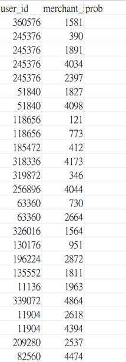

# 顧客重複購買預測

## 研究目標

```
1. 針對哪些新消費者在未來可能成為忠實顧客

2. 預測消費者再次購買的機率
```

## 範例



prob 這一列需要進行預測，因此為空。 

## 資料集

### 1. 訓練集
    總筆數: 260864 筆
    特徵個數: 3
    資料大小: 3.37 MB 
### 2. 測試集
    總筆數: 261477 筆
    特徵個數: 3
    資料大小: 3.13 MB 
### 3. 使用者資訊
    總筆數: 424170 筆
    特徵個數: 3
    資料大小: 4.34 MB 
### 4. 使用者行為日誌
    總筆數: 54925330 筆
    特徵個數: 7
    資料大小: 1821.72 MB

## 預期方法與模型
    
首先，使用 Pandas 和 NumPy 進行資料處理與分析。這些工具將幫助我們有效地清理和操作數據，確保數據的完整性和一致性。接著，利用 Matplotlib 進行資料視覺化，以便更直觀地展示數據趨勢和模式。

在特徵工程方面，將使用 groupby() 來計算使用者與商家之間的互動特徵，例如商品數量和類別數量等。這些特徵將有助於我們更好地理解和預測使用者行為。

在模型訓練階段，將使用以下演算法：

1. 隨機森林 (Random Forest)：這是一種集成學習方法，通過多個決策樹的投票結果來提高預測準確性。
2. 邏輯迴歸 (Logistic Regression)：這是一種廣泛使用的分類算法，適合處理二元分類問題。
3. XGBoost：這是一種強大的梯度提升算法，能夠有效處理大規模數據並提高模型的預測性能。
4. LightGBM：這是一種高效的梯度提升算法，特別適合處理大數據集和高維數據。

## 預期結果

資料視覺化將包括購買量前五名店家及其顧客回購表現、顧客回購率前五名等。這些視覺化結果將幫助我們識別出最具價值的商家和顧客群體。

我們將利用 F1-score 和 ROC AUC 分數來評估模型的預測效果。F1-score 是一種綜合考慮精確率和召回率的評估指標，而 ROC AUC 分數則衡量模型在不同閾值下的分類性能。為了確保模型具有預測價值，ROC AUC 分數需大於 0.5。

最後，將最佳模型的預測結果儲存為 CSV 檔案 (prediction.csv)，以便進行進一步的分析和應用。

## 配置環境

### Jupyter
```bash
conda create --name myenv python=3.10
```

### 安裝套件
```bash
# 針對 Jupyter 的環境
pip install -r requirements.txt
```

## 參考資料

### 資料集 - [連結](https://tianchi.aliyun.com/competition/entrance/231576/information)

### 顧客的重複購買預測 - [連結](https://www.heywhale.com/mw/project/6044a21f6b48c2001529f1b5/content)
